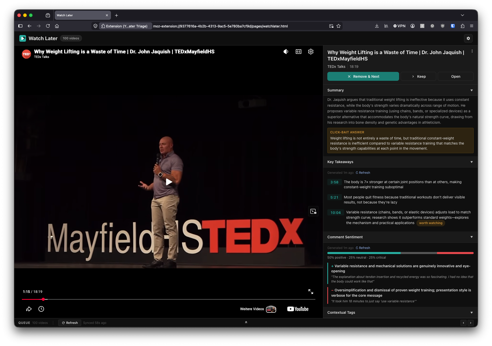

# YT Watch Later Triage


When you use YouTube's Watch Later feature, you often end up with a long list that keeps growing faster than you can watch through it. This extension helps by analyzing each video and giving you an overview of what to expect. Often enough, that's all the information you actually need.

For each video it offers

- a quick summary
- an answer to click-bait titles
- a few key takeaways or a list of things mentioned in the title (e.g. "7 ways to do X")
- a general comment sentiment, with examples of what people say



---

## Download and install

### tl;dr
- Download the extension as a `.xpi` from [Releases](https://github.com/DavidSlr/yt-watch-later-triage/releases) and drag the file into Firefox.
- Run the transcript harvester: `docker run -d --name wla-transcript-harvester --restart unless-stopped -p 47823:47823 -e WLA_HARVESTER_PORT=47823 ghcr.io/davidslr/wla-transcript-harvester:latest`
- Make sure you're logged into YouTube
- Click the extension icon in Firefox and add your Gemini or Claude API key in the settings ([details](#3-ai-provider))

### 1. The extension

Grab the latest signed `.xpi` from the [Releases page](https://github.com/DavidSlr/yt-watch-later-triage/releases) and drag it into Firefox, or open it via `about:addons` → the gear menu → **Install Add-on From File…**. Signed releases install permanently, like any other Firefox extension.

### 2. Transcript harvester

Feeding transcripts into the AI analysis needs a small local service that fetches them from YouTube. Requires [Docker](https://www.docker.com/).

**Option A — docker compose.** Download [`harvester/docker-compose.yml`](harvester/docker-compose.yml) and run this in the folder you saved it to:

```bash
docker compose up -d
```

**Option B — single command**, no file or repo needed:

```
docker run -d --name wla-transcript-harvester --restart unless-stopped -p 47823:47823 -e WLA_HARVESTER_PORT=47823 ghcr.io/davidslr/wla-transcript-harvester:latest
```

It's one line so it works as-is in PowerShell, Command Prompt, or Git Bash/WSL. `--restart unless-stopped` means Docker brings it back automatically after a crash, a Docker Desktop restart, or a reboot — it only stays off if you explicitly stop it. On Windows, that also requires **Docker Desktop → Settings → General → "Start Docker Desktop when you log in"** to be enabled (on by default), since Docker itself has to be running for the container to come back.

Either way, this starts a local service on `http://localhost:47823`. Point the extension at it in **Settings → Transcript harvester** (this is the default URL, so usually nothing to change). Check `http://localhost:47823/status` for diagnostics if transcripts aren't coming through. Without the harvester running, AI analysis still works — it just relies on metadata and comments instead of the transcript.

### 3. AI provider

Open the extension's settings (gear icon) and add an API key for either:
- **Anthropic Claude (recommended)** — paid. Create an account at [platform.claude.com](https://platform.claude.com), add a small budget, and grab an API key. This is a separate API account — it does not work with your Claude.ai subscription. During testing, analyzing around 130 videos cost about $0.70.
- **Google Gemini (free)** — ~250 requests/day, no card required. Get a key at [aistudio.google.com](https://aistudio.google.com/apikey). It sometimes refuses requests during periods of high load from other users.

Without an AI provider set up, you can still browse your Watch Later list — you just won't get any analysis.

---

## Usage

1. Make sure you're **logged into YouTube** in Firefox
2. Click the **YT Watch Later Triage** icon in the toolbar
3. A new tab opens with your Watch Later list; click a queue card to load it into the embedded player
4. The sidebar shows video info, action buttons (Remove & Next / Keep / Open), and — if AI is configured — Summary, Key Takeaways, Comment Sentiment, and Contextual Tags
5. Click **Refresh** in the queue bar to reload the list

---

## How it works

YouTube's official Data API blocks Watch Later access. This extension sidesteps that by fetching `youtube.com/playlist?list=WL` directly from within Firefox, where your session cookies are already present. It parses YouTube's embedded page data (`ytInitialData`) to extract video metadata, and uses YouTube's internal InnerTube API (same authenticated session) for removal, comments, and player data.

Two optional pieces extend this:
- **AI analysis** — bring your own API key (Google Gemini or Anthropic Claude) in the extension's settings. The extension sends video metadata, transcript, and comments to your chosen provider and renders the response as a summary, takeaways, sentiment breakdown, and tags.
- **Transcript harvester** — a small local Docker service that fetches public video transcripts (logged out, no credentials involved) so the AI has more than just metadata to work from. Optional but highly recommended — without it, AI analysis still runs on metadata and comments alone.

---

## Web component design system

The UI is built from a library of Lit-based web components that follow consistent design standards and aim to meet WCAG accessibility guidelines.

**Check out the design system on Storybook:** [davidslr.github.io/yt-watch-later-triage](https://davidslr.github.io/yt-watch-later-triage/)

---

## Development

See [DEVELOPMENT.md](DEVELOPMENT.md) for local setup, the build/release process, and technical notes on how the YouTube integration works.

---

## Browser extension permissions

| Permission | Why |
|---|---|
| `*://*.youtube.com/*`, `*://*.youtube-nocookie.com/*` (host) | Fetch the Watch Later playlist, call InnerTube (remove/comments/player), embed the video player |
| `https://generativelanguage.googleapis.com/*`, `https://api.anthropic.com/*` (host) | Send analysis requests to your configured AI provider |
| `http://localhost:47823/*` (host) | Talk to the local transcript harvester, if running |
| `cookies` | Read the `SAPISID` cookie to authenticate InnerTube requests |
| `tabs` | Open the Watch Later tab when the toolbar icon is clicked |
| `webRequest`, `webRequestBlocking` | Fix the video embed's `Referer` header (works around YouTube embed error 152/153) |
| `storage` | Store AI settings and a per-video analysis cache locally |

---

## Known limitations

- **YouTube internals may change.** The extension parses `ytInitialData`, an undocumented internal structure. If YouTube changes their page format, parsing may need updating.
- **~100 videos per page.** The first load shows up to 100 videos; further pages load via continuation tokens.
- **Firefox only.** Chrome's MV3 service workers handle credentialed fetches differently; Chrome support would need adjustments.
- **AI and transcripts are best-effort.** Analysis quality depends on the chosen provider/model; transcripts are skipped (not blocked) for videos with captions disabled or the harvester offline.

---

## File structure

```
yt-watch-later-triage/
├── manifest.json              Extension manifest (MV3)
├── background.js              Playlist fetch, remove API, embed Referer fix
├── content.js                 Runs in a YouTube tab; all InnerTube API calls
│
├── pages/                     The extension's tab UI
│   ├── watchlater.html/js/css   Player, sidebar, queue
│   ├── ai.js                    Gemini + Claude provider adapter
│   ├── prompts.js                AI prompt templates
│   ├── components.js            Imports the wla-* components (bundle entry point)
│   └── components.bundle.js     Built bundle the page actually loads (gitignored)
│
├── components/                 wla-* Lit web component library
│   ├── wla-button.js, wla-modal.js, wla-tabs.js, wla-accordion(-group).js, …
│   └── index.js                  Barrel export (for Storybook / external use)
│
├── tokens/
│   ├── tokens.css              Design tokens — colors, spacing, type, radii
│   └── tokens.json             Same tokens, synced to Figma Variables
│
├── stories/                    Storybook stories, one per component
│   ├── foundation/             Colors, spacing, typography, icons, a11y
│   └── patterns/               Composed multi-component examples
│
├── harvester/                  Optional transcript microservice
│   ├── server.js, transcript.js
│   └── Dockerfile, docker-compose.yml
│
├── .github/workflows/
│   ├── storybook.yml           Deploys Storybook to GitHub Pages on push to master
│   ├── release.yml             Signs + releases the extension on a version tag push
│   └── harvester-release.yml   Publishes the harvester image to GHCR on harvester/** changes
│
├── web-ext-config.cjs          web-ext packaging config (excludes dev-only sources)
│
└── icons/
    ├── icon-48.png, icon-96.png, icon.svg
```

---

## License

MIT
